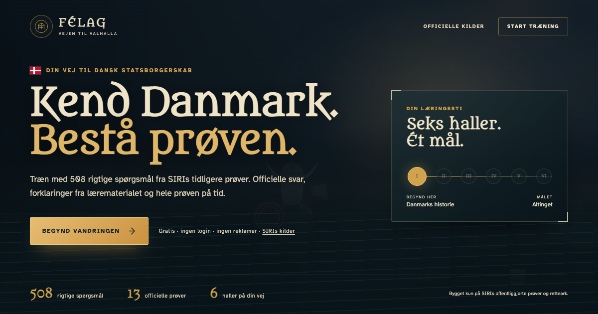

<div align="center">

# Félag

**Free training for the Danish citizenship test, Indfødsretsprøven.**

[](https://proteusiq.github.io/felag/)

[](https://github.com/Proteusiq/felag/releases)
[](data/questions.jsonl)
[-223448?style=flat-square)](https://danskogproever.dk/borger/indfoedsretsproeve-statsborgerskab/forberedelse-til-indfoedsretsproeven/)
[](#)

[](https://proteusiq.github.io/felag/)

</div>

*Félag* is Old Norse. It means a fellowship, a joint venture, people who lay
their wealth together in one pot. The word survives in English as *fellow*.
Learning should be free, so this is free. No accounts, no advertisements, no
paywall.

> If it served you well, you can buy us coffee, a MobilePay box Félag: 1845MC, or not 🫣.

## Of the road, and why it was made

The realm sets a test for those who would join it. The material for that test
is already free, and thirteen past papers lie in the open with their answer
keys beside them.

Others have fenced that common ground and asked coin for passage, sometimes
guiding travellers wrong. Félag takes nothing that is not freely given, and
points every traveller back to the well it drew from.

## What is carried

Every question was truly asked. The answers are SIRI's own, taken from the
*retteark*. Nothing here was invented, and nothing was reworded to seem wiser
than the source.

```
570 questions asked across 13 papers, from 2020 to 2026
-> 508 that differ
   397 laeremateriale   35 of the 45 you will face
    46 vaerdier          5 you will face, and 4 you must answer
    65 aktuelt           5 you will face, drawn from the year's news
```

The three kinds do not behave alike, and so they are not trained alike.

| Kind | Returns between papers | What that demands |
|---|---|---|
| Læremateriale | 31 in 100 | Drill it. How often a thing is asked is itself worth knowing. |
| Værdier | 13 in 100 | Barely returns. Learn the principle, never the answer. |
| Aktuelt | none | Never returns. The old ones show the shape, not the answer. |

## The road itself

Six halls, one for each chapter of the læremateriale. Clear a hall and the next
opens. The tests stay open from the first day, so the gate paces the study
without ever barring the door.

| | Hall | Questions |
|---|---|---|
| I | Danmarks historie | 116 |
| II | Det danske demokrati | 74 |
| III | Den danske økonomi | 19 |
| IV | Danmark og omverdenen | 29 |
| V | Dansk kulturliv | 46 |
| VI | Temaopslag | 111 |

Beyond them stand:

- **Tidslinjen**, chapter 1 sailed period by period, from the vikings to now
- **Dysten**, a race against Bjørn or against a friend, settled under a raised banner or a struck one, with both scores side by side
- **Tinget**, the five values questions, taught as ten principles rather than drilled
- **Altinget**, the whole paper on the clock

And on the road itself, the only date that matters: how many days until the ship
puts in.

A challenge is a link and nothing else. The seed rebuilds the identical paper,
in the same order, with the same option order, so the race is fair without a
server, an account or a database behind it.

    #dyst=dyst~1toqq5u~111011100111001

## Two things the papers gave up under questioning

> [!IMPORTANT]
> **The same question is not always the same question.** SIRI keeps a stem and
> changes what stands beneath it. *"Hvilken rettighed er sikret i grundloven?"*
> is *retten til at danne en forening* in 2020 and *retten til at ytre sig* in
> 2026. A question is therefore known by its stem and its choices together.
> Whoever knows it by the stem alone will merge the two, keep one answer, and
> teach it confidently to the wrong end.

> [!TIP]
> **The third door opens more often than the others.** Across the thirteen
> papers, C is correct in 39.3 of 100 three-choice questions, where blind chance
> would give 33.3. That is 181 of 460, some 2.7 standard deviations out. It is
> real, it is weak, and it will not carry you. Félag shuffles the choices at
> every sitting so that what you learn is the matter itself and not the seat it
> sat in.

> [!WARNING]
> **Facts age, and the stale ones are thrown out.** A current-affairs answer was
> true only on the day it was set. *"Hvilket politisk parti er i regering?"*
> answered Socialdemokratiet in 2020; since 2022 it has been a coalition of
> Socialdemokratiet, Venstre and Moderaterne. Denmark had a Queen until January
> 2024 and has had King Frederik X since.
>
> Answers that have gone stale are hand-checked against the current material and
> then **excluded from every draw**, not merely footnoted. Current-affairs
> questions never repeat between papers, so they are kept out of practice
> altogether and appear only in the full mock, each labelled with its sitting.
> Where an answer still holds but rests on something that moves, the panel says
> so: Venstre became the largest mayoral party at the election of 18 November
> 2025 with 40 mayors to Socialdemokratiet's 26.

## The tide table

SIRI holds the test twice a year, in May or June and in November or December,
and publishes the coming year's dates by 1 October. Félag carries the next one
in a single object at the head of `js/app.js`, beside the day it was last
checked against the source:

```js
const EXAM = { date: '2026-11-25', checked: '2026-08-13', source: '…' };
```

One line on the road says how many days remain. Not a card: three of those
stand above it already, and a fourth would compete with the thing you came to
click. Deadlines, fees and enrolment are SIRI's business and are left to SIRI.

> [!IMPORTANT]
> **Twice a year, somebody must look this up.** The line refuses to count
> downwards past its own date: once `date` is in the past it shows no number at
> all, only the way to
> [SIRI's own table](https://danskogproever.dk/tilmeldingsfrister-og-proevedatoer/).
> A confidently wrong date here is worse than no date.

## The law of the Ting

Forty-five questions in forty-five minutes. Thirty-six correct to pass, **and**
no fewer than four of the five questions on Danish values.

> [!CAUTION]
> The values gate stands apart. A traveller may answer well overall and still be
> turned back at it alone. That is precisely where most are turned back, and so
> Félag weighs it separately and says so plainly.

## Where the answers come from

Answer a question and the panel gives you more than a tick. Every question has
an explanation: direct explanations draw on the material or the historical
event, while Danish-values questions teach the underlying legal principle.
Beneath that sits the provenance: which sittings asked this, which chapter it
belongs to, and links back to the official question and material.

> [!NOTE]
> Restating the answer is never shown. The highlight already said it.

<details>
<summary><strong>Running and rebuilding it yourself</strong></summary>

<br>

The site is live at **[proteusiq.github.io/felag](https://proteusiq.github.io/felag/)**,
so there is rarely a reason to run it locally. If you want to anyway, it is plain
static files with no build, no bundler and no dependencies:

```sh
python3 -m http.server 8765
```

### Forging the bank anew

Requires [uv](https://docs.astral.sh/uv/). The script declares its own
dependencies inline, after PEP 723, so there is nothing to install beforehand.

```sh
uv run tools/content.py all      # fetch the papers, then read them
uv run tools/content.py fetch    # fetch only
uv run tools/content.py extract  # read only
```

The source PDFs come to rest in `data/raw/` and are **never committed**. They
weigh 29MB, they are not ours, and they can always be fetched again. What is
kept is what was won from them.

`.github/workflows/content.yml` sails this course each month and raises a pull
request whenever SIRI lands a new paper. It never writes
`data/explanations.jsonl`, so words written by hand outlive every regeneration.
Should SIRI reword a stem, its id changes, and the extractor names the stranded
explanation `ORPHANED` rather than letting it drown quietly.

### The lay of the ship

```
index.html               the hull
css/fonts.css            two faces, self-hosted, no third-party request
css/app.css              tokens, the light of the hour, motion
js/cast.js               the six guides, one shared frame
js/scenes.js             scenes as data, drawn by one hand; Holger waits in one
js/app.js                state, routing, the halls, the law, the tide table
tools/content.py         uv script: fetch, read, ground in the material
data/questions.jsonl     won from the papers, never edited by hand
data/explanations.jsonl  written by hand, joined by id
assets/fonts/            Metamorphous for the carving, Atkinson for the reading
favicon.ico              Holger, at the path browsers ask for by name
llms.txt                 for assistants that answer these questions now
```

### Of ink and lettering

Colour is lifted off Norse and Celtic type specimens rather than a UI kit: aged
parchment, iron-gall navy, gold leaf on the capitals, oxide rust, and the sage
of an old printed border. **Metamorphous** cuts the headings; **Atkinson
Hyperlegible** carries everything read closely, which is not a matter of taste.
Most people here are reading Danish as a second language against a clock, and a
carved *d* reads as *ð*. The costume stops at the headings.

</details>

## Word of origin

The material and the past papers are published by
[Styrelsen for International Rekruttering og Integration (SIRI)](https://danskogproever.dk/borger/indfoedsretsproeve-statsborgerskab/forberedelse-til-indfoedsretsproeven/).

> [!NOTE]
> Félag is **not affiliated with SIRI, nor endorsed by them**. It is an
> independent free study aid and claims no authority of its own. Trust the
> official source above this one. Follow Danish news for the questions on
> current affairs, for no fixed material can hold them.

*Kun spørgsmål der er stillet. Kun svar der er givet.*
